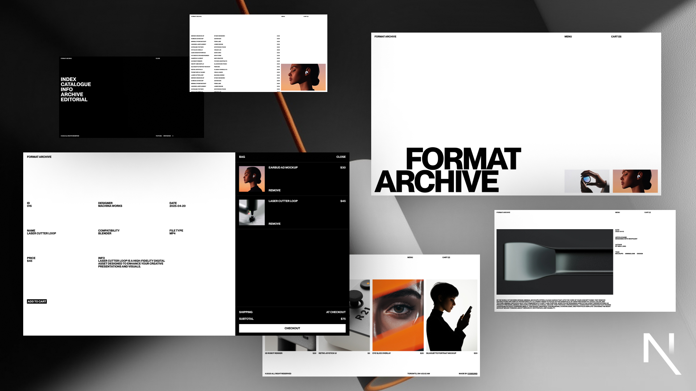

# Format Archive - Modern Digital Marketplace Template



## 🌟 [🔗 **LIVE DEMO**](https://website-template-04.vercel.app/) 🌟

**👆 Click above to see the template in action!**

A sophisticated digital marketplace template built with Next.js, featuring smooth animations, modern design aesthetics, and e-commerce functionality. Perfect for digital design agencies, creative marketplaces, and asset stores.

## ✨ Features

- **Modern E-commerce**: Full shopping cart functionality with local storage persistence
- **Smooth Animations**: Powered by GSAP with custom page transitions using next-view-transitions
- **Responsive Design**: Fully responsive layout optimized for all devices
- **Performance Optimized**: Built with Next.js 15 for optimal performance and SEO
- **Interactive UI**: Advanced menu animations and smooth scrolling experiences
- **Product Showcase**: Dynamic product catalog with detailed product pages
- **Editorial System**: Built-in blog/editorial section for content marketing
- **Shopping Cart**: Persistent cart functionality with Zustand state management
- **TypeScript Ready**: Full TypeScript support for better development experience

## 🚀 Tech Stack

- **Framework**: Next.js 15.3.1 with App Router
- **State Management**: Zustand 5.0.3
- **Animations**: GSAP 3.12.7 with @gsap/react
- **Smooth Scrolling**: Lenis 1.3.1 for enhanced scroll experience
- **Page Transitions**: next-view-transitions 0.3.4
- **Text Animations**: split-type 0.3.4
- **Styling**: Custom CSS with modern design principles
- **Package Manager**: npm

## 📦 Installation

1. Clone the repository:
```bash
git clone https://github.com/Alexey9911/website-template-04.git
```

2. Navigate to the project directory:
```bash
cd website-template-04
```

3. Install dependencies:
```bash
npm install --legacy-peer-deps
```

4. Run the development server:
```bash
npm run dev
```

5. Open http://localhost:3000 in your browser.

## 🔧 Available Scripts

- `npm run dev` - Start development server with hot reload
- `npm run build` - Build for production
- `npm run start` - Start production server
- `npm run lint` - Run ESLint for code quality

## 📁 Project Structure

```
format-archive/
├── public/
│   ├── product_images/
│   ├── article_images/
│   ├── hero.gif
│   └── image1.jpg
├── src/
│   ├── app/
│   │   ├── catalogue/
│   │   ├── editorial/
│   │   ├── archive/
│   │   ├── info/
│   │   └── globals.css
│   ├── components/
│   │   ├── Menu/
│   │   ├── Cart/
│   │   └── Footer/
│   ├── store/
│   │   └── useCartStore.js
│   ├── products.js
│   └── articles.js
├── package.json
└── README.md
```

## 🎨 Customization

This template is designed to be easily customizable:

- **Products**: Update `src/products.js` to modify product catalog
- **Articles**: Modify `src/articles.js` for editorial content
- **Colors & Typography**: Update CSS custom properties in `globals.css`
- **Animations**: Adjust GSAP timelines in component files
- **Images**: Replace product and article images with your own assets
- **Branding**: Update logo, colors, and content to match your brand

## 📱 Pages

- **Home (/)** - Hero section with featured products and animated elements
- **Catalogue (/catalogue)** - Product showcase with filtering and detailed views
- **Editorial (/editorial)** - Blog/article section with content management
- **Archive (/archive)** - Historical product archive
- **Info (/info)** - About page and company information

## 🛒 E-commerce Features

- **Shopping Cart**: Add/remove products with persistent storage
- **Product Details**: Detailed product pages with specifications
- **State Management**: Zustand for cart state across the application
- **Local Storage**: Cart persistence across browser sessions

## 🌐 Live Demo & Deployment

### 🚀 [View Live Demo](https://website-template-04.vercel.app/)

See the template in action at: **https://website-template-04.vercel.app/**

### Deploy Your Own

This project is optimized for deployment on Vercel:

1. Push your code to GitHub
2. Connect your GitHub repository to Vercel
3. Vercel will automatically detect the build settings
4. Your site will be deployed with automatic updates on every push

[](https://vercel.com/new/clone?repository-url=https://github.com/Alexey9911/website-template-04)

### Manual Deployment Steps:

1. Build the project:
```bash
npm run build
```

2. Start the production server:
```bash
npm run start
```

## 🎯 Performance Features

- Next.js App Router for optimal performance
- Image optimization and lazy loading
- Code splitting and dynamic imports
- Smooth scroll performance with Lenis
- Efficient animation rendering with GSAP
- State management optimization with Zustand

## 📄 License

This project is open source and available under the MIT License.

## 🤝 Contributing

Contributions, issues, and feature requests are welcome! Feel free to check the [issues page](https://github.com/Alexey9911/website-template-04/issues).

## ⭐ Show your support

Give a ⭐️ if this project helped you create an amazing digital marketplace!

---

Built with ❤️ using Next.js, GSAP, and modern web technologies.
